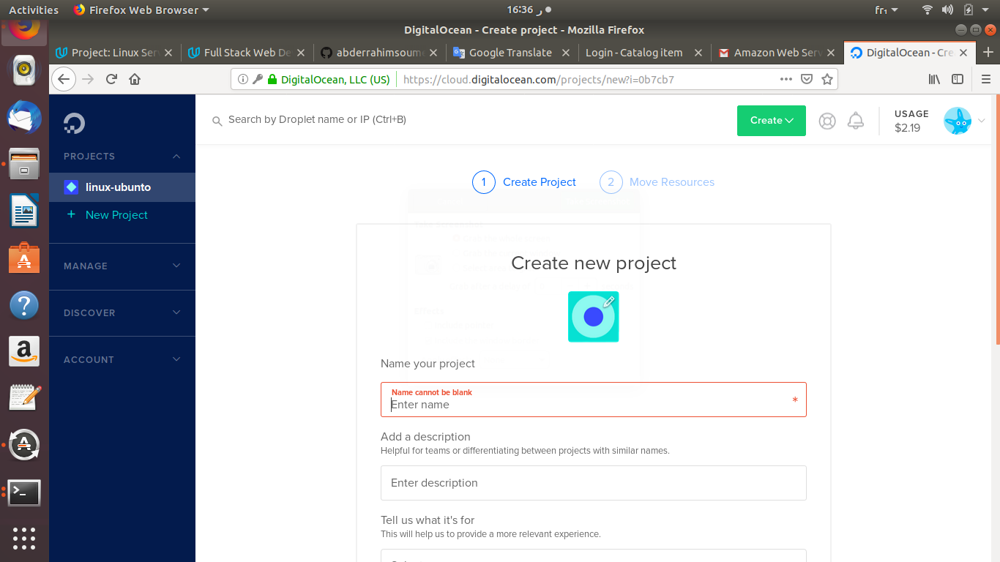
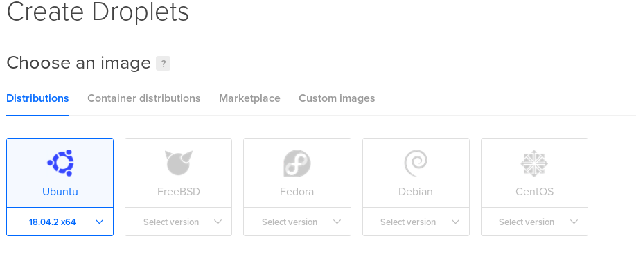
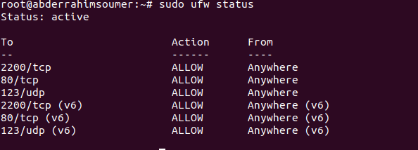

# Project: Linux Server Configuration

Install a Linux server and prepare it to host the web applications (Catalog item). securing the server from a number of attack vectors, install and configure a database server, and deploy one of the existing web applications onto it.

- **IP address:** 142.93.49.78
- **SSH port:** 2200
- **web application URL :**


## Get your server:

1- create an account on [DigitalOcean](https://m.do.co/c/379434780044), then add a new project and new droplet.


choose ubunto

2- verify your mail, you will receive an email contain the default password to login using ssh.
``` ssh root@142.93.49.78 -p 22 ```
For security reasons, you will be required to change this Droplet’s root password when you login.

## Secure your server.

3- Update all currently installed packages.

Run the following command:
```
$ sudo apt-get update
$ sudo apt-get upgrade
```

4- Change the SSH port from 22 to 2200. [source](https://www.godaddy.com/help/changing-the-ssh-port-for-your-linux-server-7306)

- Connect to your server via SSH 

- Switch to the root user

- Run the following command : ``` nano /etc/ssh/sshd_config ```

- Locate the following line: 
	#Port 22

-Remove # and change 22 to 2200.

-Restart the sshd service by running the following command: ``` service sshd restart ```

5- Configure the Uncomplicated Firewall (UFW) to only allow incoming connections for SSH (port 2200), HTTP (port 80), and NTP (port 123).

Run the following command

``` $ sudo ufw status ``` show status of firewall and ufw managed rules.

``` $ sudo ufw default deny incoming ``` To deny all incoming connections.

``` $ sudo ufw default allow outgoing ``` To allow all outgoing connections. 

``` $ sudo ufw allow 2200/tcp ``` To allow connection for ssh port 2200.

``` $ sudo ufw allow www ``` To allow connection for  HTTP (port 80).

``` $ sudo ufw allow 123/udp ``` To allow UDP traffic on port 123 in order to communicate with the NTP pool.

``` $ sudo ufw enable ``` To enable the firewall.

``` $ sudo ufw status ``` To check whether firewall is enable or not.

expected results:


Resource : [ufw community](https://help.ubuntu.com/community/UFW) , [NTP](https://www.digitalocean.com/community/tutorials/how-to-configure-ntp-for-use-in-the-ntp-pool-project-on-ubuntu-16-04)

